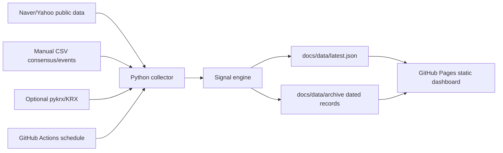

# Architecture

## 1. Strategy Context

Source strategy: https://chatgpt.com/share/6a17bbc2-52a0-83a4-b4d4-55d948a33a5d

The target strategy is not a generic valuation dashboard. It is a timing dashboard for:

```text
Samsung Electronics relative strength
+ SK Hynix relative weakness
```

The preferred trade model in the shared notes is:

```text
1H = Samsung Electronics stock futures long 11 contracts
   + SK Hynix stock futures short 1 contract
```

The dashboard must therefore answer one question:

```text
Is the Samsung / SK Hynix spread starting to reverse after an extreme gap?
```

## 2. Required Information

| Domain | Required Data | Purpose | Current Implementation |
|---|---|---|---|
| Price | 005930, 000660 daily and latest price | Relative momentum, z-score, PnL | Naver realtime and daily APIs |
| Market cap | Current market cap and shares | SK/Samsung market cap ratio | Naver Finance, fallback shares |
| Spread | Weighted log spread, 60D z-score, 20D MA | Entry/exit timing | Python signal engine |
| Risk | 1H notional, hedge ratio, margin estimate, stress PnL | Sizing and loss planning | Python signal engine |
| Macro | KOSPI, NASDAQ, VIX, USD/KRW, SOXX | Risk regime context | Yahoo chart API |
| Consensus | Target prices and OP estimates | Samsung revision advantage | Manual CSV seed |
| HBM events | HBM4/customer/supply news | Catalyst and thesis risk | Manual CSV event tape |
| Flow | Foreign/institution flow, short data | Hynix fade confirmation | Optional `pykrx` hook |

## 3. System Diagram



## 4. Runtime Modes

Local near-real-time mode:

```bash
python3 scripts/watch_snapshot.py --seconds 60
python3 -m http.server 8000 -d docs
```

GitHub Pages mode:

```text
GitHub Actions cron -> archive current JSON -> build JSON -> archive dated JSON -> commit -> Pages serves static HTML
```

Because GitHub Pages is static, true tick-by-tick updates cannot happen from the server side. The practical production pattern is scheduled snapshots plus optional browser refresh. API keys must stay in GitHub Actions secrets or local environment variables, never in client JavaScript.

## 5. Signal Model

### 5.1 Market Cap Gap

```text
SK/Samsung market cap ratio = SK Hynix market cap / Samsung market cap
Samsung premium = Samsung market cap / SK Hynix market cap - 1
```

Interpretation:

| Ratio | Dashboard Meaning |
|---:|---|
| below 0.60 | Low pair-trade tension |
| 0.60-0.75 | Watch |
| 0.75-0.85 | Gap is large enough to monitor reversal |
| above 0.85 | Extreme gap |

This is a waiting condition, not an entry trigger.

### 5.2 Weighted Spread

```text
spread = log(Samsung / Samsung_0) - h * log(SK Hynix / SK Hynix_0)
h = 0.66 by default
```

Entry timing:

| Spread State | Interpretation |
|---|---|
| z-score <= -2.0 | Oversold, watch only |
| z-score keeps falling | No entry |
| z-score recovers above -1.5 after <= -2.0 | 1H candidate |
| spread holds above 20D MA | Add confirmation |
| z-score around 0 | Partial exit candidate |
| z-score >= +1 | Exit candidate |

### 5.3 Scorecard

| Component | Max |
|---|---:|
| Value gap | 15 |
| Spread oversold | 15 |
| Spread reversal | 25 |
| Earnings revision | 20 |
| HBM event | 15 |
| Hynix fade | 10 |
| Total | 100 |

Action thresholds:

| Score | Action |
|---:|---|
| 0-40 | No entry |
| 40-60 | Watch |
| 60-75 | 1H test candidate |
| 75+ | 1H candidate |

Spread reversal is a required flag. If it is not confirmed, the dashboard downgrades the action to "wait for reversal" even when the score is high.

## 6. Code Layout

```text
src/shls/
  config.py        Strategy constants and symbols
  providers.py     Yahoo/Naver/optional pykrx data collection
  indicators.py    Rolling math, z-score, volatility, beta
  manual_data.py   Consensus and HBM event CSV loaders
  signals.py       Scorecard, risk model, chart series
  snapshot.py      JSON snapshot orchestration
  archive.py       Date-keyed JSON archive writer
scripts/
  archive_data.py
  build_snapshot.py
  watch_snapshot.py
  smoke_test.py
docs/
  index.html
  assets/
  data/latest.json
  data/archive/
data/manual/
  consensus.csv
  hbm_events.csv
```

## 7. Key Technologies

| Layer | Technology |
|---|---|
| Collector | Python 3.12 standard library |
| Public quote source | Naver realtime/daily endpoints, Naver Finance page, Yahoo macro chart endpoint |
| Optional enrichment | `pykrx`, KRX, broker APIs |
| Signal engine | Pure Python rolling indicators |
| Static UI | HTML, CSS, JavaScript |
| Charts | Chart.js CDN |
| Hosting | GitHub Pages from `docs/` |
| Automation | GitHub Actions scheduled workflow |

## 8. Production Upgrades

1. Add a broker quote provider for exchange-grade real-time data.
2. Replace seeded consensus CSV with FnGuide/WiseReport or internal analyst data.
3. Add KRX short-sale balance and credit balance.
4. Store history in append-only JSONL or SQLite before publishing static rollups.
5. Add alert delivery through Telegram, Slack, or email when `WAIT_FOR_REVERSAL` becomes `ENTER_1H`.
